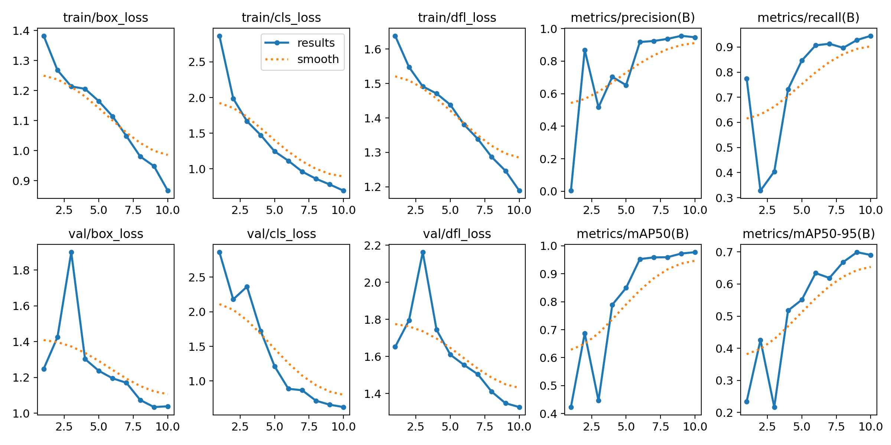
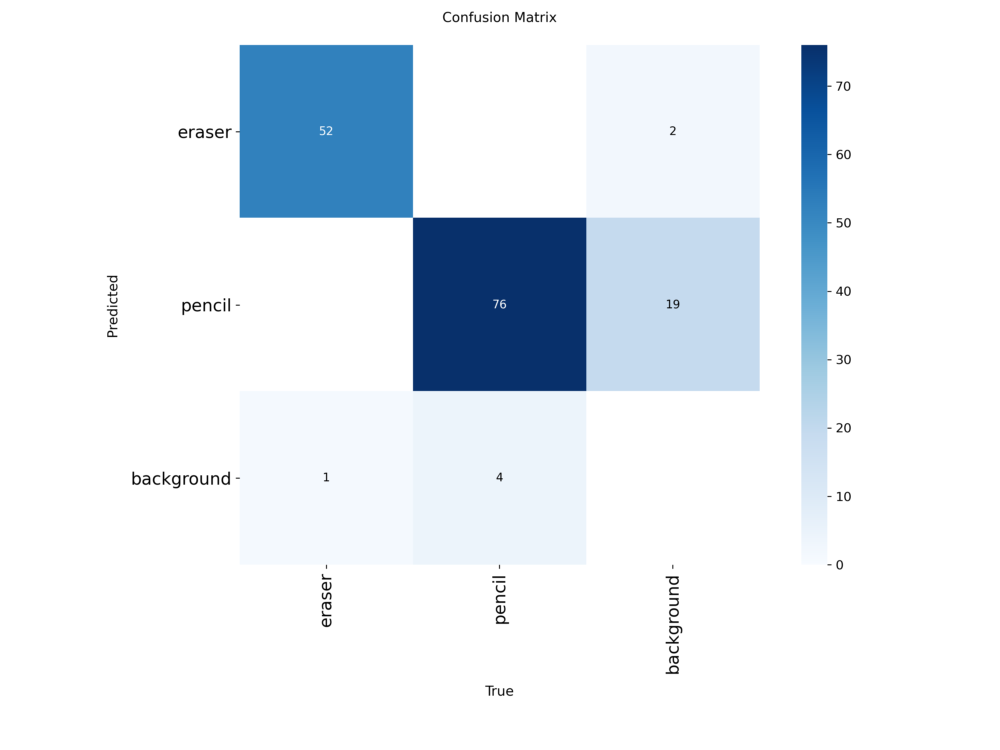
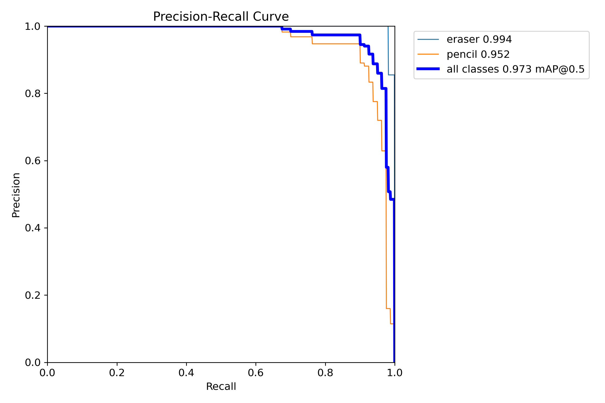
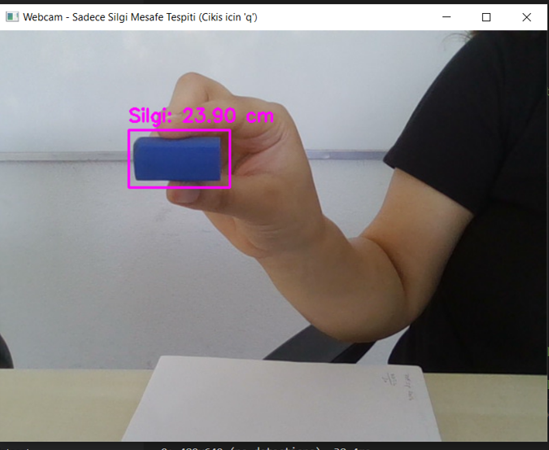

# YOLO Object Distance Tracker

Bu proje, nesne tespiti ve mesafe ölçümü için YOLOv8 tabanlı bir derin öğrenme modelini kullanır. Özellikle "silgi" ve "kalem" nesneleri için gerçek zamanlı olarak mesafe tahmini yapar. Model, özel olarak toplanmış ve Roboflow üzerinden etiketlenmiş bir veri setiyle eğitilmiştir.

## Proje Yapısı

```
distance_calculate/
├── scripts/
│   ├── olcum.py              # Gerçek zamanlı mesafe ölçümü ve nesne tespiti
│   └── cam_calibrate.py      # Kamera kalibrasyonu ve piksel-genişlik ölçümü
├── distance_model/
│   ├── weights/
│   │   ├── best.pt           # En iyi eğitimli model ağırlığı
│   │   └── last.pt           # Son eğitimli model ağırlığı
│   ├── [Eğitim ve analiz görselleri, sonuçlar]
├── yolov11_dataset/
│   ├── train/valid/test/     # Eğitim, doğrulama ve test veri setleri
│   ├── data.yaml             # Sınıf isimleri ve yol tanımları
│   ├── README.dataset.txt    # Veri seti açıklaması
│   └── README.roboflow.txt   # Roboflow veri seti detayları
├── requirements.txt          # Gerekli Python paketleri
└── olcum_ekran_goruntusu.png # (Kullanıcıdan bekleniyor)
```

## Kurulum

```bash
git clone https://github.com/medinercin/yolo-object-distance-tracker.git
cd yolo-object-distance-tracker
pip install -r requirements.txt
```

## Kullanım

### 1. Kamera Kalibrasyonu

Kendi kameranız için odak uzaklığını (focal length) bulmak için:

```bash
python scripts/cam_calibrate.py
```
Terminalde tespit edilen nesnenin piksel genişliğini göreceksiniz. Bunu cetvelle ölçtüğünüz gerçek genişlik ile birlikte, focal length hesaplamasında kullanabilirsiniz.

### 2. Gerçek Zamanlı Mesafe Ölçümü

```bash
python scripts/olcum.py
```
Webcam açılır ve "silgi" nesnesi tespit edildiğinde, ekranda tahmini mesafe gösterilir.

### 3. Model ve Veri Seti

- Model ağırlıkları: `distance_model/weights/best.pt`
- Veri seti: Roboflow üzerinden etiketlenmiş, YOLOv11 formatında. Sınıflar: `eraser`, `pencil`.

## Sonuçlar ve Analizler

Aşağıda modelin eğitim ve test sürecine ait bazı görselleri bulabilirsiniz:

- Eğitim Sonuçları:  
  
- Confusion Matrix:  
  
- Precision-Recall Curve:  
  

## Proje Çıktısı

Aşağıda, uygulamanın çalışırken aldığı bir ekran görüntüsü yer almaktadır:

> **Not:** Lütfen `olcum_ekran_goruntusu.png` dosyasını kök dizine ekleyin.



## Veri Seti Hakkında

- Kaynak: [Roboflow - eraser-pencil_labeling](https://universe.roboflow.com/facews/eraser-pencil_labeling)
- Lisans: CC BY 4.0
- Toplam Görüntü: 1207
- Sınıflar: Silgi (eraser), Kalem (pencil)

## Gereksinimler

- Python 3.8+
- ultralytics==8.3.159
- opencv-python==4.8.0.76
- numpy==1.24.4

## Katkı ve Lisans

Bu proje açık kaynaklıdır ve [CC BY 4.0](https://creativecommons.org/licenses/by/4.0/) lisansı ile sunulmaktadır. 